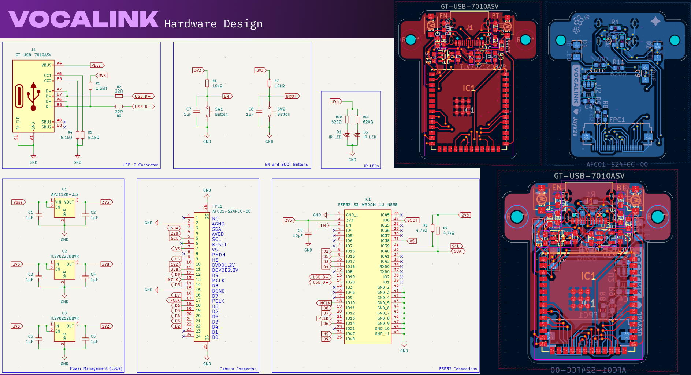
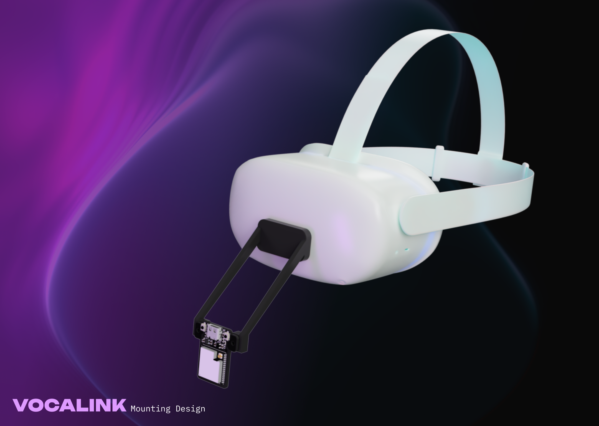

# VOCALINK

VOCALINK is a DIY mouth tracking solution built on [Project Babble](https://github.com/Project-Babble/ProjectBabble) that brings natural facial expressions to your VR avatar. 

I wanted deeper immersion in social VR platforms, but got tired of my avatar's lifeless stare while the rest of my body moved freely through virtual worlds. VOCALINK solves this by capturing real-time mouth and jaw movements with an OV2640 camera and machine learning, translating every smile, word, and expression into authentic avatar animations that finally make virtual conversations feel genuinely human.

> [!CAUTION]
> Please exercise extreme caution when messing around with IR emitters. Whilst the eyes are not directly exposed to the IR emitters, they are in close vicinity with each other. Please make sure you know what you are doing when assembling the IR emitters. I am not responsible for any damages you cause when using the designs provided in this project. 

## Hardware Design

## Mounting Design

## Bill Of Materials

Click to expand/collapse

| Part #                      | LCSC #   | Order Quantity | Unit Price (USD) | Ext. Price (USD) | Link                                                                                                                             |
|-----------------------------|----------|----------------|------------------|------------------|----------------------------------------------------------------------------------------------------------------------------------|
| UMK107AB7105KA-T            | C105174  | 50             | 0.0181           | 0.91             | https://lcsc.com/product-detail/multilayer-ceramic-capacitors-mlcc-smd-smt_taiyo-yuden-umk107ab7105ka-t_C105174.html             |
| CL31B106KBHNNNE             | C89632   | 10             | 0.0629           | 0.63             | https://lcsc.com/product-detail/multilayer-ceramic-capacitors-mlcc-smd-smt_samsung-electro-mechanics-cl31b106kbhnnne_C89632.html |
| XL-3216HIRC-850             | C965891  | 20             | 0.0283           | 0.57             | https://lcsc.com/product-detail/infrared-led-emitters_xinglight-xl-3216hirc-850_C965891.html                                     |
| AFC01-S24FCC-00             | C262276  | 5              | 0.1124           | 0.56             | https://lcsc.com/product-detail/ffc-fpc-flat-flexible-connector-assemblies_jushuo-afc01-s24fcc-00_C262276.html                   |
| ESP32-S3-WROOM-1U-N8R8      | C2980300 | 1              | 5.5182           | 5.52             | https://lcsc.com/product-detail/wifi-modules_espressif-esp32-s3-wroom-1u-n8r8_C2980300.html                                      |
| GT-USB-7010ASV              | C2988369 | 5              | 0.0805           | 0.40             | https://lcsc.com/product-detail/usb-connectors_g-switch-gt-usb-7010asv_C2988369.html                                             |
| 0603WAF1501T5E              | C22843   | 100            | 0.0011           | 0.11             | https://lcsc.com/product-detail/chip-resistor-surface-mount_uni-royal-0603waf1501t5e_C22843.html                                 |
| RC0603FR-0722RL             | C107701  | 100            | 0.0012           | 0.12             | https://lcsc.com/product-detail/chip-resistor-surface-mount_yageo-rc0603fr-0722rl_C107701.html                                   |
| FRC0603F5101TS              | C2907044 | 100            | 0.0010           | 0.10             | https://lcsc.com/product-detail/chip-resistor-surface-mount_fojan-frc0603f5101ts_C2907044.html                                   |
| RC0603FR-0710KL             | C98220   | 100            | 0.0011           | 0.11             | https://lcsc.com/product-detail/chip-resistor-surface-mount_yageo-rc0603fr-0710kl_C98220.html                                    |
| RC0603FR-074K7L             | C99782   | 100            | 0.0011           | 0.11             | https://lcsc.com/product-detail/chip-resistor-surface-mount_yageo-rc0603fr-074k7l_C99782.html                                    |
| RC0603FR-07620RL            | C137695  | 100            | 0.0012           | 0.12             | https://lcsc.com/product-detail/chip-resistor-surface-mount_yageo-rc0603fr-07620rl_C137695.html                                  |
| TS-1088-AR02016             | C720477  | 10             | 0.0412           | 0.41             | https://lcsc.com/product-detail/tactile-switches_xunpu-ts-1088-ar02016_C720477.html                                              |
| AP2112K-3.3TRG1             | C51118   | 5              | 0.1091           | 0.55             | https://lcsc.com/product-detail/voltage-regulators-linear-low-drop-out-ldo-regulators_diodes-ap2112k-3-3trg1_C51118.html         |
| TLV70228DBVR                | C183080  | 5              | 0.1024           | 0.51             | https://lcsc.com/product-detail/voltage-regulators-linear-low-drop-out-ldo-regulators_ti-tlv70228dbvr_C183080.html               |
| TLV70212DBVR                | C81462   | 5              | 0.1154           | 0.58             | https://lcsc.com/product-detail/voltage-regulators-linear-low-drop-out-ldo-regulators_ti-tlv70212dbvr_C81462.html                |
| OV2640 Night Vision         | N/A      | 1              | 1                | 0                | https://www.aliexpress.com/item/1005003040149873.html                                                                            |
|                             |          |                |                  |                  |                                                                                                                                  |
| LCSC Components             |          | US$15.92       |                  |                  |                                                                                                                                  |
| LCSC Shipping               |          | US$9.34        |                  |                  |                                                                                                                                  |
| Economic PCBA - Front Layer | A$50.54  | ~US$33         |                  |                  |                                                                                                                                  |
| JLCPCB Shipping             | A$16.86  | ~US$11         |                  |                  |                                                                                                                                  |
|                             |          |                |                  |                  |                                                                                                                                  |
| Total                       | US$70.26 |                |                  |                  |                                                                                                                                  |

## Acknowledgments
- [Project Babble](https://github.com/Project-Babble/ProjectBabble) - Firmware for mouth tracking and hardware selection guide.
- [Oculus Quest 2 3D Model](https://skfb.ly/otI9p) - by Nosakhae is licensed under [Creative Commons Attribution](http://creativecommons.org/licenses/by/4.0/).
